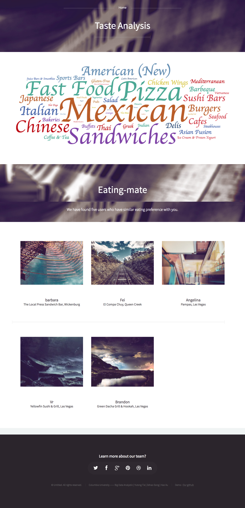

# yelp_recommendation
Course project for Big Data Analysis

## Structure

1. scrapy
    1. yelp_fetcher
    
        Retrieve business list via Yelp Search API
        
    2. yelp_scrapy
    
        Grab the reviews of all buisness gathered by yelp_fetcher

2. spark

    1. data
    
        Containing all parsed data.
        
        **Note 1:** The compressed raw data is more than 1G, we didn't upload these data to github. 
        
        **Note 2:** The scripts used for proccessing the data havn't been uploaded.

    2. target
    
        Store the model trained by CF.
    
    3. recommendation.ipynb
    
        Train the recomendation models and save the model into spark/target
        
    3. recommendation.py

        Generate the recomendation for each user, by loading the model stored in target folder.
        
        To run this scripts,
        
        First, modidy the range in the following lines, which is the range of users to recommend.
        
        ```python
        with open('cache.jl', "a") as f:
            for i in range(100,110):
                print "Start Calculation On %d"%i
                f.write( json.dumps( getTaste(i) ) )
        f.close()
        ```
        
        Second, in the terminal, run `spark-submit recomendation.py` and wait, it might take a long time.
        
        Here is format of the output for each user:
        
        ```javascript
        [
            1,                                  // User Id
            [ "Island Fusion, Las Vegas" ],     // Recommended Restaurants
            [ "Jeremy" ],                       // REcommended Eating Mates
            [                                   // Taste Analysis
                ["Chinese", 178]                // The list of keywork-weight paris
            ]
        ]
        ```
3. web

    Front UI for the project.
    
    **Note:** The result are not generated in real-time. The recommendations for each user have been precalculated and stored in `cache.jl`.
    
    First, input the user id and click find!
    
    
    
    Second, you will see the result, taste analysis and recomended users&restaurants.
    
    

## Spider

### How to start the spider
1. Update `scrapy/yelp_scrapy/yelp_scrapy/data/business.jl`
2. `cd scrapy/yelp_scrapy`
3. `sh start.sh` (MacOS)

### business.jl

Each line is a valid json list:

```
[
    <business id>::string,
    <business name>::string,
    <rating>::float,
    <category>::list,
    <location>::dict
]
```

Here is an example
```
["matcha-cafe-wabi-new-york", "Matcha Cafe Wabi", 4.5, [["Coffee & Tea", "coffee"] ], {"latitude": 40.72355, "longitude": -73.98291 }]
```

### Output

For each record in `business.jl`, spider will fetch and parse the data from `https://www.yelp.com/biz/<business id>`. The results will be saved into `scrapy/yelp_scrapy/yelp_scrapy/data/<business id>.jl` in JSON Lines format.

```
[
    <user name>::string,
    <rating>::string,
    <business name>::string,
    <review>:: string
]
```

Example:

```
["Moon R.", "1.0", "matcha-cafe-wabi-new-york", "I don't know what the matcha latte tastes like because it's closed at 6:30 pm on a Friday!\n\nBetter get here a hour earlier than the closing time!"]
```
